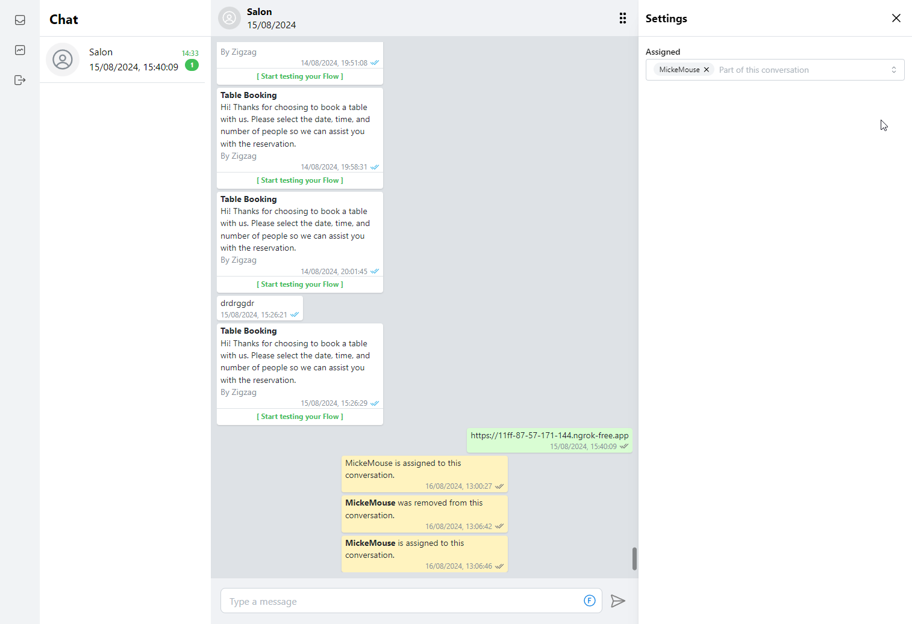

# Whatsapp Application

This project is a WhatsApp-based chat application that allows users to interact with WhatsApp via the WhatsApp Business API. The application provides a frontend interface built with React, using Realm for data storage and state management. It supports real-time chat functionality, user conversations, and message management.

## Features

- **Real-time Chat**: Users can engage in real-time conversations.
- **Unread Message Count**: The application tracks unread messages per conversation, showing users how many new messages they have.
- **User Conversations**: Each user has their own conversation history, and the application tracks when the user last viewed each conversation.
- **WhatsApp Business API Integration**: The application integrates with the WhatsApp Business API to handle incoming and outgoing messages.
- **Responsive Design**: The UI adapts to mobile and desktop layouts, providing a smooth experience across devices.
- **Attachments Support**: Users can send and receive attachments, such as images or documents.
- **Settings Drawer**: Users can access and manage conversation settings through a settings drawer in the UI.

## Tech Stack

- **Frontend**: React, Mantine UI components, Wouter for routing
- **State Management**: Realm for local storage and real-time data synchronization
- **Backend**: WhatsApp Business API for messaging integration
- **Styling**: Mantine for UI components and layout

## Screenshot



## Authentication (After deployment)

Add the URL to the authentication providers (e.g., Facebook) in MongoDB Atlas.
Add the URL to "Allowed Domains for the JavaScript SDK" in the Facebook app settings.
Add the URL to "Allowed Request Origins" in the app settings in MongoDB Atlas.

## Facebook Access Token Setup

To enable Facebook login functionality in your local environment, follow these steps to generate and configure the required access token.

### Step 1: Generate a Facebook Access Token

1. Go to the [Facebook Graph API Explorer](https://developers.facebook.com/tools/explorer/).
2. Log in with your Facebook account if prompted.
3. Select your Facebook application from the **Meta App** dropdown menu.
4. In the **Permissions** section, ensure that you check the `email` permission.
5. Click **Generate Access Token**.
6. Copy the generated access token.

### Step 2: Update Your Local Environment

1. In the root directory of the project, locate the `.example.env` file.
2. Rename `.example.env` to `.env`.
3. Open the `.env` file and replace the placeholder for the `VITE_FACEBOOK_ACCESS_TOKEN` variable with your generated access token.

   Your `.env` file should look like this:

   ```env
   VITE_FACEBOOK_ACCESS_TOKEN=your-generated-access-token-here
   ```
